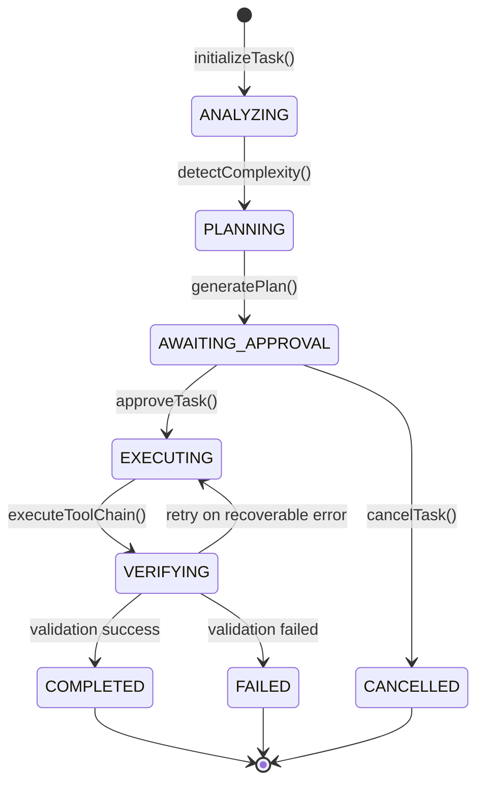

I have created the following plan after thorough exploration and analysis of the codebase. Follow the below plan verbatim. Trust the files and references. Do not re-verify what's written in the plan. Explore only when absolutely necessary. First implement all the proposed file changes and then I'll review all the changes together at the end.

## Observations

The codebase has a solid foundation for autonomous agent orchestration. Key existing components include: `routeMCPRequest` in `file:src/server-lib/mcp-router-agent.ts` for multi-tool orchestration with intent classification and pipeline execution; `WorkflowExecution` and `WorkflowExecutionLog` database models for state tracking; Redis caching for performance optimization; and a robust AI fallback handler with provider chains. The agent API currently handles single-request/response patterns but lacks autonomous multi-step execution capabilities. The MCP router already supports orchestration pipelines, which can be leveraged for autonomous task execution.

## Approach

Build a state machine-based orchestration engine that coordinates autonomous task execution through distinct phases: analyze, plan, approve, execute, verify, and complete. The orchestrator will integrate with the existing MCP router for tool execution, use database models for persistent state tracking, and implement a task context manager to maintain execution state across multiple steps. Complexity detection will analyze task requirements to determine execution strategy (simple/medium/complex), and the system will route tool requests through the existing `routeMCPRequest` function to leverage proven orchestration patterns.

## Implementation Steps

### 1. Core Orchestrator Structure

Create `file:src/server-lib/autonomous-agent-orchestrator.ts` with the following components:

**State Machine Definition**
- Define `TaskExecutionState` enum with values: `ANALYZING`, `PLANNING`, `AWAITING_APPROVAL`, `EXECUTING`, `VERIFYING`, `COMPLETED`, `FAILED`, `CANCELLED`
- Create `TaskExecutionContext` interface containing: `taskId`, `userId`, `agentId`, `originalPrompt`, `currentState`, `complexity`, `metadata`, `createdAt`, `updatedAt`
- Implement state transition validation to ensure valid state progressions (e.g., cannot go from ANALYZING directly to EXECUTING)

**Main Orchestrator Class**
- Create `AutonomousAgentOrchestrator` class with methods:
  - `async initializeTask(userId: string, agentId: string, prompt: string): Promise<string>` - Creates new task execution record in database using `WorkflowExecution` model, returns taskId
  - `async analyzeTask(taskId: string): Promise<TaskAnalysis>` - Analyzes prompt complexity and requirements
  - `async transitionState(taskId: string, newState: TaskExecutionState): Promise<void>` - Updates state in database with validation
  - `async getTaskContext(taskId: string): Promise<TaskExecutionContext>` - Retrieves current execution context from database
  - `async executeWorkflow(taskId: string): Promise<void>` - Main orchestration loop that drives state transitions

**Integration Points**
- Import `routeMCPRequest` from `file:src/server-lib/mcp-router-agent.ts` for tool execution
- Use `WorkflowExecution` model from Prisma schema for persistent state storage
- Leverage `WorkflowExecutionLog` for detailed step-by-step logging
- Import `getRedisClient` from `file:src/server-lib/redis-cache.ts` for caching task contexts

### 2. Complexity Detection Algorithm

Implement `TaskComplexityAnalyzer` class within the orchestrator file:

**Analysis Criteria**
- **Simple Tasks** (score 0-30): Single-file changes, basic queries, straightforward operations
  - Indicators: Keywords like "fix typo", "update text", "change color", single file mentioned
  - Estimated steps: 1-3 actions
  - No external dependencies or API calls required

- **Medium Tasks** (score 31-70): Multi-file changes, feature additions, moderate refactoring
  - Indicators: Keywords like "add feature", "create component", "implement", multiple files mentioned
  - Estimated steps: 4-10 actions
  - May require codebase search and file system operations

- **Complex Tasks** (score 71-100): Full feature development, architectural changes, multi-system integration
  - Indicators: Keywords like "build system", "integrate with", "refactor architecture", "add authentication"
  - Estimated steps: 10+ actions
  - Requires orchestration pipelines, external tool integration, testing

**Implementation**
- Create `async detectComplexity(prompt: string, context?: Record<string, any>): Promise<ComplexityResult>` method
- Use AI-powered analysis via `executeSimpleGeneration` from `file:src/server-lib/ai-fallback-handler.ts` with specialized prompt
- Analyze prompt for: number of files mentioned, action verbs used, technical depth, dependencies mentioned
- Return `ComplexityResult` interface with: `level: 'simple' | 'medium' | 'complex'`, `score: number`, `estimatedSteps: number`, `reasoning: string`, `suggestedTools: string[]`
- Cache complexity analysis results in Redis with key pattern: `task:complexity:{taskId}`

### 3. State Machine Implementation

Create state transition logic with validation and persistence:

**State Transition Map**
```
ANALYZING → PLANNING
PLANNING → AWAITING_APPROVAL
AWAITING_APPROVAL → EXECUTING (on approval) | CANCELLED (on rejection)
EXECUTING → VERIFYING
VERIFYING → COMPLETED (on success) | FAILED (on error) | EXECUTING (retry)
COMPLETED → (terminal state)
FAILED → (terminal state, can be retried manually)
CANCELLED → (terminal state)
```

**State Handlers**
- `async handleAnalyzeState(taskId: string): Promise<void>` - Runs complexity detection, stores analysis results, transitions to PLANNING
- `async handlePlanningState(taskId: string): Promise<void>` - Generates execution plan (delegated to planner in subsequent phase), transitions to AWAITING_APPROVAL
- `async handleExecutingState(taskId: string): Promise<void>` - Executes planned actions using MCP router, logs each step, transitions to VERIFYING
- `async handleVerifyingState(taskId: string): Promise<void>` - Validates execution results, checks for errors, transitions to COMPLETED or FAILED

**Persistence Layer**
- Update `WorkflowExecution.status` field to reflect current state
- Create `WorkflowExecutionLog` entries for each state transition with: `action_type: 'state_transition'`, `input_data: { fromState, toState }`, `output_data: { reason, metadata }`
- Store intermediate results in `WorkflowExecution.trigger_data` as JSON

### 4. MCP Router Integration

Connect orchestrator with existing MCP routing infrastructure:

**Tool Routing Strategy**
- For simple tasks: Direct single-tool execution via `routeMCPRequest`
- For medium tasks: Sequential tool execution with data flow between steps
- For complex tasks: Use orchestration pipelines from `ORCHESTRATION_PIPELINES` in `file:src/server-lib/mcp-router-agent.ts`

**Integration Methods**
- Create `async executeToolChain(taskId: string, tools: MCPToolRoute[]): Promise<MCPToolExecutionResult[]>` method
- Wrap `routeMCPRequest` calls with error handling and retry logic
- Store tool execution results in `WorkflowExecutionLog` with: `action_type: 'mcp_tool_execution'`, `input_data: { toolRoute }`, `output_data: { result }`
- Use `MCPRouterRequest` interface from `file:src/shared/models/mcp-types.ts` for type safety

**Error Handling**
- Catch `MCPError` from `file:src/lib/mcp/errors.ts`
- Implement retry logic with exponential backoff (max 3 retries)
- Log failures to `WorkflowExecutionLog` with detailed error information
- Transition to FAILED state if all retries exhausted

### 5. Task Context Manager

Implement context management for maintaining state across execution steps:

**Context Storage**
- Create `TaskContextManager` class with methods:
  - `async saveContext(taskId: string, context: TaskExecutionContext): Promise<void>` - Persists to database and Redis
  - `async loadContext(taskId: string): Promise<TaskExecutionContext>` - Retrieves from Redis (fast) or database (fallback)
  - `async updateContext(taskId: string, updates: Partial<TaskExecutionContext>): Promise<void>` - Merges updates with existing context
  - `async clearContext(taskId: string): Promise<void>` - Removes from Redis and marks as completed in database

**Context Structure**
- Store in `WorkflowExecution.trigger_data` as JSON with schema:
  ```typescript
  {
    taskId: string,
    userId: string,
    agentId: string,
    originalPrompt: string,
    currentState: TaskExecutionState,
    complexity: ComplexityResult,
    analysisResults: TaskAnalysis,
    executionPlan: any, // Will be populated by planner in subsequent phase
    executionResults: MCPToolExecutionResult[],
    verificationResults: any,
    metadata: {
      startTime: Date,
      stateTransitions: Array<{ from: string, to: string, timestamp: Date }>,
      toolsUsed: string[],
      totalCost: number,
      totalDuration: number
    }
  }
  ```

**Caching Strategy**
- Use Redis for active task contexts with TTL of 1 hour
- Cache key pattern: `task:context:{taskId}`
- Invalidate cache on state transitions
- Fallback to database if Redis unavailable

### 6. Workflow Execution Loop

Implement the main orchestration loop that drives autonomous execution:

**Main Loop Logic**
```typescript
async executeWorkflow(taskId: string): Promise<void> {
  while (true) {
    const context = await this.contextManager.loadContext(taskId);
    
    switch (context.currentState) {
      case TaskExecutionState.ANALYZING:
        await this.handleAnalyzeState(taskId);
        break;
      case TaskExecutionState.PLANNING:
        await this.handlePlanningState(taskId);
        break;
      case TaskExecutionState.AWAITING_APPROVAL:
        // Wait for external approval, exit loop
        return;
      case TaskExecutionState.EXECUTING:
        await this.handleExecutingState(taskId);
        break;
      case TaskExecutionState.VERIFYING:
        await this.handleVerifyingState(taskId);
        break;
      case TaskExecutionState.COMPLETED:
      case TaskExecutionState.FAILED:
      case TaskExecutionState.CANCELLED:
        // Terminal states, exit loop
        return;
    }
    
    // Add small delay to prevent tight loops
    await new Promise(resolve => setTimeout(resolve, 100));
  }
}
```

**Error Recovery**
- Wrap entire loop in try-catch to handle unexpected errors
- On error: Log to `WorkflowExecutionLog`, transition to FAILED state, store error details
- Implement circuit breaker pattern to prevent infinite retry loops
- Expose `async retryTask(taskId: string): Promise<void>` method for manual retries

### 7. Type Definitions and Exports

Add comprehensive TypeScript interfaces:

```typescript
export interface TaskAnalysis {
  complexity: ComplexityResult;
  requiredTools: string[];
  estimatedDuration: number;
  risks: string[];
  dependencies: string[];
}

export interface ComplexityResult {
  level: 'simple' | 'medium' | 'complex';
  score: number;
  estimatedSteps: number;
  reasoning: string;
  suggestedTools: string[];
}

export interface TaskExecutionContext {
  taskId: string;
  userId: string;
  agentId: string;
  originalPrompt: string;
  currentState: TaskExecutionState;
  complexity: ComplexityResult;
  analysisResults?: TaskAnalysis;
  executionPlan?: any;
  executionResults?: MCPToolExecutionResult[];
  verificationResults?: any;
  metadata: TaskMetadata;
  createdAt: Date;
  updatedAt: Date;
}

export interface TaskMetadata {
  startTime: Date;
  stateTransitions: StateTransition[];
  toolsUsed: string[];
  totalCost: number;
  totalDuration: number;
}

export interface StateTransition {
  from: TaskExecutionState;
  to: TaskExecutionState;
  timestamp: Date;
  reason?: string;
}
```

**Export Main Functions**
- `export { AutonomousAgentOrchestrator }`
- `export { TaskExecutionState, TaskExecutionContext, TaskAnalysis, ComplexityResult }`
- `export async function createAutonomousTask(userId: string, agentId: string, prompt: string): Promise<string>`
- `export async function getTaskStatus(taskId: string): Promise<TaskExecutionContext>`
- `export async function approveTask(taskId: string): Promise<void>`
- `export async function cancelTask(taskId: string): Promise<void>`

## Architecture Diagram



## Integration Points

- **Database**: Use `WorkflowExecution` and `WorkflowExecutionLog` models from `file:prisma/schema.prisma`
- **MCP Router**: Call `routeMCPRequest` from `file:src/server-lib/mcp-router-agent.ts` for tool execution
- **AI Fallback**: Use `executeSimpleGeneration` from `file:src/server-lib/ai-fallback-handler.ts` for AI-powered analysis
- **Redis Cache**: Import from `file:src/server-lib/redis-cache.ts` for context caching
- **Types**: Import MCP types from `file:src/shared/models/mcp-types.ts`
- **Agent Config**: Import `AI_AGENT_CONFIGS` from `file:src/shared/models/ai-agents.ts`

## Testing Considerations

- Unit tests for state transition validation
- Integration tests for MCP router interaction
- End-to-end tests for complete workflow execution
- Mock database and Redis for isolated testing
- Test error recovery and retry logic
- Validate complexity detection accuracy with sample prompts