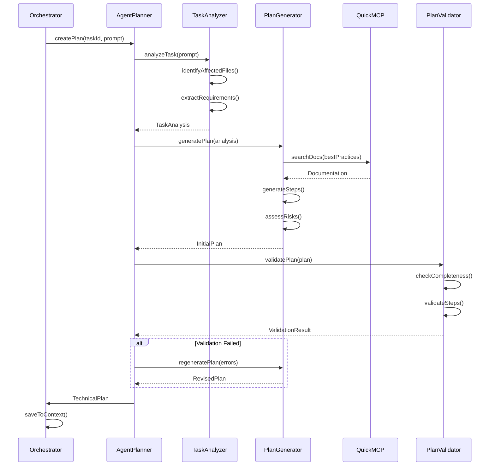

I have created the following plan after thorough exploration and analysis of the codebase. Follow the below plan verbatim. Trust the files and references. Do not re-verify what's written in the plan. Explore only when absolutely necessary. First implement all the proposed file changes and then I'll review all the changes together at the end.

## Observations

The autonomous orchestrator is already implemented with a state machine that handles task execution flow. The `handlePlanningState` method currently generates simple plans based on complexity levels. The system uses `executeSimpleGeneration` for AI-powered analysis, `QuickMCP.searchDocs()` for documentation search, and stores execution context in both Redis and the `WorkflowExecution` database table. The web dev agent has a comprehensive system prompt defining best practices for React, Next.js, and TypeScript development.

## Approach

Create a dedicated AI-powered planning system (`agent-planner.ts`) that generates comprehensive technical specifications before task execution. The planner will analyze the user's prompt, identify affected files and dependencies, assess risks, and generate detailed implementation steps. It will leverage MCP documentation search to enrich plans with framework-specific best practices and validate plan completeness before presenting to users for approval. The planner integrates seamlessly with the existing orchestrator's planning state.

## Implementation Steps

### 1. Create Core Planning Types and Interfaces

**File:** `file:src/server-lib/agent-planner.ts`

Define TypeScript interfaces for the planning system:
- `TechnicalPlan` - Main plan structure containing all specification details
- `AffectedFile` - File path, change type (create/modify/delete), and reason
- `PlanStep` - Individual implementation step with description, tools needed, and estimated duration
- `DependencyInfo` - External dependencies, internal module dependencies, and version requirements
- `RiskAssessment` - Risk level, description, mitigation strategy, and impact
- `AcceptanceCriteria` - Testable criteria for plan completion
- `PlanValidationResult` - Validation status, errors, warnings, and completeness score

### 2. Implement AI-Powered Task Analysis Engine

**File:** `file:src/server-lib/agent-planner.ts`

Create `TaskAnalyzer` class with methods:
- `analyzeTask(prompt, agentId, context)` - Main analysis entry point that uses AI to understand task requirements
- `identifyAffectedFiles(prompt, projectContext)` - Uses pattern matching and AI to determine which files need changes
- `extractTechnicalRequirements(prompt)` - Parses prompt for specific technical requirements (frameworks, libraries, patterns)
- `assessComplexity(requirements)` - Evaluates task complexity based on scope, dependencies, and technical challenges

Use `executeSimpleGeneration` with a specialized system prompt for technical analysis. The prompt should instruct the AI to return structured JSON with file paths, change types, and technical requirements.

### 3. Build Documentation-Enriched Plan Generator

**File:** `file:src/server-lib/agent-planner.ts`

Create `PlanGenerator` class with methods:
- `generatePlan(taskAnalysis, agentConfig)` - Main plan generation orchestrator
- `enrichWithBestPractices(plan, agentId)` - Uses `QuickMCP.searchDocs()` to fetch framework-specific best practices
- `generateImplementationSteps(analysis, bestPractices)` - Creates detailed step-by-step implementation guide
- `identifyDependencies(analysis)` - Extracts npm packages, internal modules, and API dependencies
- `assessRisks(analysis, plan)` - Evaluates potential risks (breaking changes, performance impacts, security concerns)
- `defineAcceptanceCriteria(analysis)` - Generates testable success criteria

For best practices enrichment:
- Query `QuickMCP.searchDocs()` with framework-specific queries (e.g., "React 19 Server Components best practices", "Next.js 15 App Router patterns")
- Parse documentation results and extract relevant guidelines
- Integrate guidelines into plan steps as inline recommendations

### 4. Implement Plan Validation System

**File:** `file:src/server-lib/agent-planner.ts`

Create `PlanValidator` class with methods:
- `validatePlan(plan)` - Main validation entry point returning `PlanValidationResult`
- `checkCompleteness(plan)` - Ensures all required fields are populated (steps, files, dependencies)
- `validateStepSequencing(steps)` - Verifies logical order and dependency flow between steps
- `checkFilePathValidity(affectedFiles)` - Validates file paths follow project conventions
- `assessRiskCoverage(risks)` - Ensures critical risks have mitigation strategies
- `validateAcceptanceCriteria(criteria)` - Checks criteria are specific, measurable, and testable

Validation rules:
- Plans must have at least 1 implementation step
- Each step must have description, estimated duration, and required tools
- Affected files must have valid paths and change justification
- High-risk items must have documented mitigation strategies
- Acceptance criteria must be verifiable

### 5. Integrate with Web Dev Agent System Prompt

**File:** `file:src/server-lib/agent-planner.ts`

Create `AgentContextIntegrator` class:
- `getAgentSystemPrompt(agentId)` - Retrieves agent configuration from `file:src/shared/models/ai-agents.ts`
- `extractCapabilities(agentConfig)` - Parses agent capabilities to understand what the agent can do
- `tailorPlanToAgent(plan, agentConfig)` - Adjusts plan steps to match agent's expertise and capabilities
- `injectAgentGuidelines(plan, systemPrompt)` - Incorporates agent-specific best practices into plan steps

For the web dev agent specifically:
- Extract React 19, Next.js 15, TypeScript guidelines from system prompt
- Ensure plan steps reference Server Components vs Client Components appropriately
- Include Server Actions for data mutations where applicable
- Add accessibility and performance optimization reminders

### 6. Create Main Planner Orchestration Class

**File:** `file:src/server-lib/agent-planner.ts`

Create `AutonomousAgentPlanner` class as the main interface:
- `createPlan(taskId, userId, agentId, prompt)` - Main public method called by orchestrator
- `loadTaskContext(taskId)` - Retrieves task context from orchestrator
- `executePlanningWorkflow(context)` - Orchestrates analysis → generation → enrichment → validation
- `savePlan(taskId, plan)` - Persists plan to task context
- `getPlan(taskId)` - Retrieves existing plan for a task

Workflow sequence:
1. Load task context and complexity analysis from orchestrator
2. Analyze task using `TaskAnalyzer`
3. Generate initial plan using `PlanGenerator`
4. Enrich plan with best practices via `QuickMCP.searchDocs()`
5. Integrate agent-specific guidelines
6. Validate plan using `PlanValidator`
7. If validation fails, regenerate with corrections
8. Save validated plan to task context
9. Return plan for user approval

### 7. Update Orchestrator Integration

**File:** `file:src/server-lib/autonomous-agent-orchestrator.ts`

Modify `handlePlanningState` method:
- Import `AutonomousAgentPlanner` from `file:src/server-lib/agent-planner.ts`
- Replace simple plan generation with: `const planner = new AutonomousAgentPlanner(); const plan = await planner.createPlan(taskId, context.userId, context.agentId, context.originalPrompt);`
- Update context with comprehensive plan: `await this.contextManager.updateContext(taskId, { executionPlan: plan });`
- Log planning details including validation results

### 8. Add Plan Formatting and Presentation Utilities

**File:** `file:src/server-lib/agent-planner.ts`

Create utility functions:
- `formatPlanForDisplay(plan)` - Converts plan to human-readable markdown format
- `generatePlanSummary(plan)` - Creates executive summary with key points
- `createPlanDiagram(plan)` - Generates mermaid diagram showing step flow and dependencies
- `exportPlanAsJSON(plan)` - Serializes plan for API responses

Markdown format should include:
- Executive summary with complexity and estimated duration
- Affected files table with change types
- Step-by-step implementation guide with tool requirements
- Dependencies section with installation commands
- Risk assessment matrix
- Acceptance criteria checklist

### 9. Implement Caching and Performance Optimization

**File:** `file:src/server-lib/agent-planner.ts`

Add caching layer:
- Cache documentation search results in Redis with 1-hour TTL
- Cache agent configurations to avoid repeated database queries
- Implement plan template caching for common task patterns
- Use `getRedisClient()` from `file:src/server-lib/redis-cache.ts`

Cache keys:
- `plan:docs:{framework}:{query_hash}` - Documentation search results
- `plan:template:{task_pattern}` - Common plan templates
- `plan:agent_config:{agentId}` - Agent configuration cache

### 10. Add Error Handling and Fallback Strategies

**File:** `file:src/server-lib/agent-planner.ts`

Implement robust error handling:
- If AI generation fails, use template-based planning with complexity-driven defaults
- If documentation search fails, use cached best practices or static guidelines
- If validation fails repeatedly, generate simplified plan with warnings
- Log all failures to `WorkflowExecutionLog` table for debugging

Fallback plan structure:
- Use orchestrator's existing `generateExecutionPlan` as ultimate fallback
- Gradually degrade features: full AI → template-based → minimal plan
- Always ensure plan has at least basic steps and file identification

## Exported Functions

Export these functions for external use:
- `createTechnicalPlan(taskId, userId, agentId, prompt)` - Main entry point
- `validatePlan(plan)` - Standalone plan validation
- `enrichPlanWithDocs(plan, queries)` - Add documentation insights to existing plan
- `formatPlanForApproval(plan)` - Format plan for user review

## Integration Points

The planner integrates with:
- `file:src/server-lib/autonomous-agent-orchestrator.ts` - Called during PLANNING state
- `file:src/shared/models/ai-agents.ts` - Retrieves agent configurations and system prompts
- `file:src/lib/mcp/agent-integration.ts` - Uses `QuickMCP.searchDocs()` for documentation
- `file:src/server-lib/ai-fallback-handler.ts` - Uses `executeSimpleGeneration()` for AI analysis
- `file:src/server-lib/redis-cache.ts` - Caches documentation and templates
- Database via `file:src/server-lib/prisma.ts` - Stores plans in `WorkflowExecution.trigger_data`

## Plan Structure Diagram

